# Intro and Strategy
This website is a Sports Memorabilia e-commerce website, where users can search through, leagues and teams memorabilia and buy them.
Users can create profiles that will save their billing info for future purchases and save their order history. The overall goal of the website
is to provide a platform for users to search for American sports memorabilia and purchase it. 

# User Stories

## Story 1

A user will be able to search through the relevant leagues by a team on the home page with a dropdown, scroll menu or through
the search bar both which are located on the home page of the website as shown in image a). Once they have selected a team or
searched for an item the merchandise will be laid out as seen on image bi)  which users can select their preferred merchandise
and be taken to the individual merchandise page as seen on images ci) cii). Here a user can choose the quantity they would like and add it
to their cart for purchase. viewing the cart will always be possible on all screens by clicking the cart link in the navigation bar and will 
look like image d). Users can then checkout by clicking the secure checkout button and be taken to the checkout page to
complete the form for payment as seen on image e). On this page, they can also save used info to their profile if they are logged in.
Finally once complete they will be taken to the order success page as seen on image f), which will have their order details,
the billing address and a confirmation that they have been sent an email. 

### a)
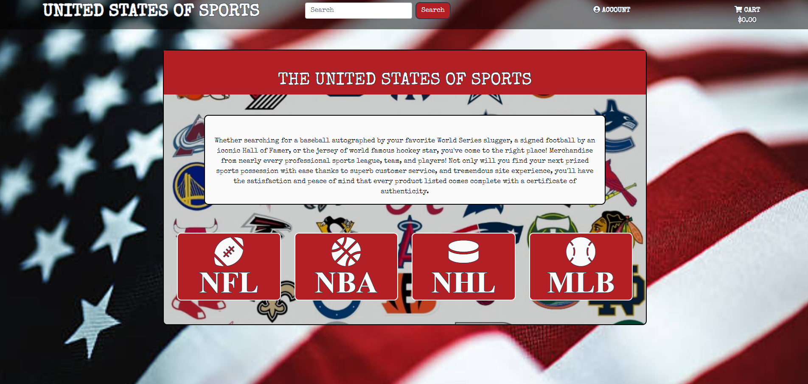

### b)
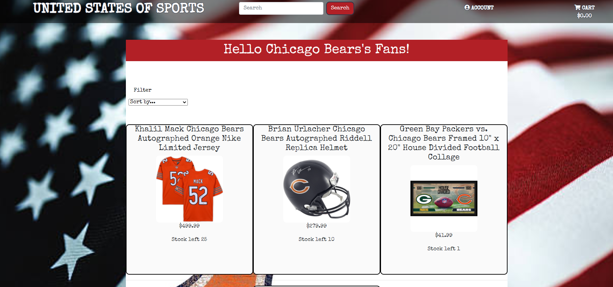

### ci)
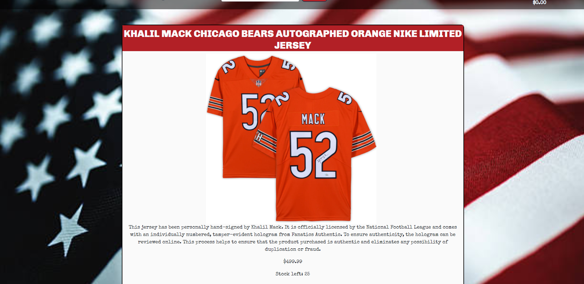
### cii)
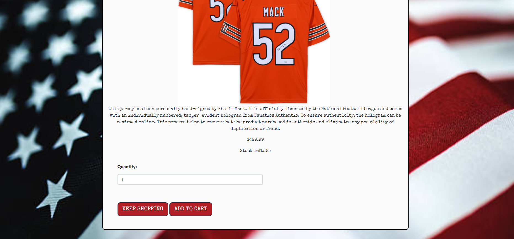

### d)
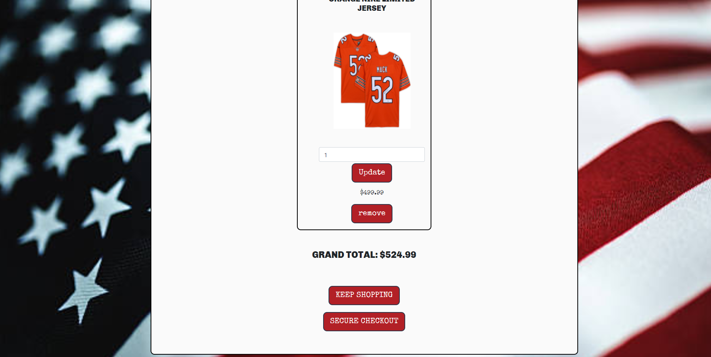

### e)
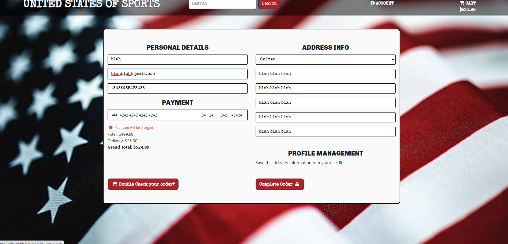

### f)
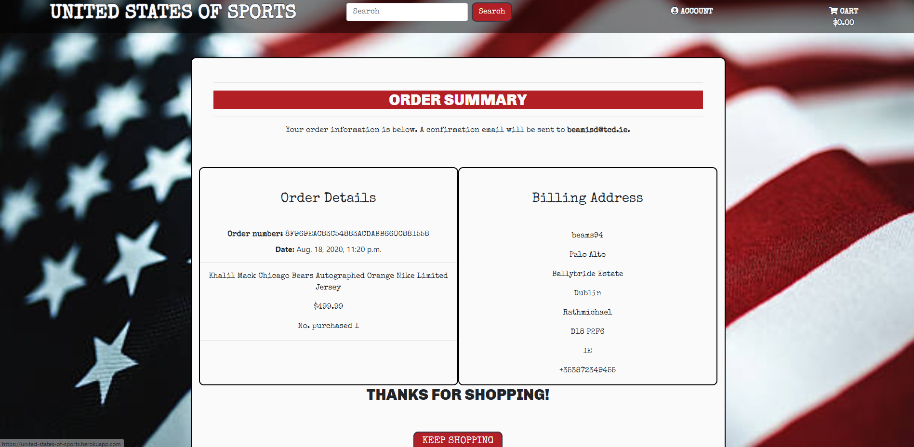

## Story 2

Users can also create profiles that can be used to store billing info such as address and phone numbers and let the user view his order-history.
The user just has to click register on the account section of the navbar and will be taken to a registration page as seen on image a) below. Once 
filled out they will need to confirm their email address and will then have the ability to add info to their profile. the layout for their profile page
can be seen in image b) with address info and personal info sections as well as a button to take you to order history if they have one. 

### a)
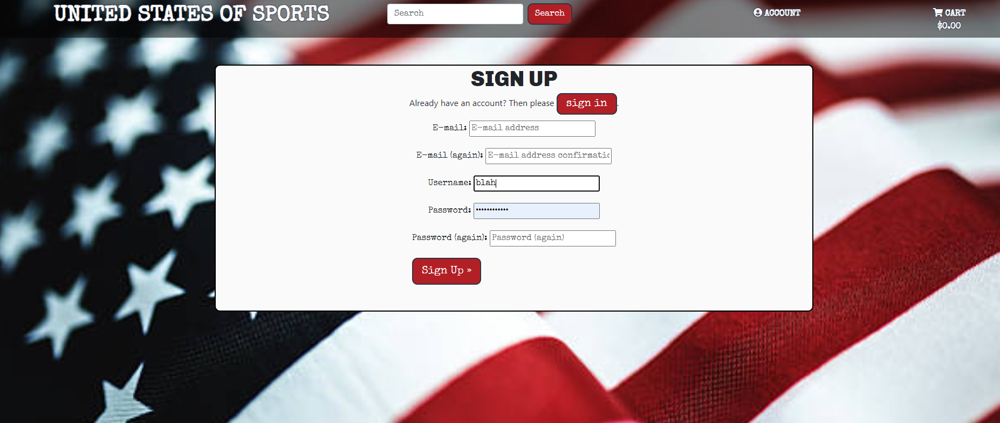

### b)
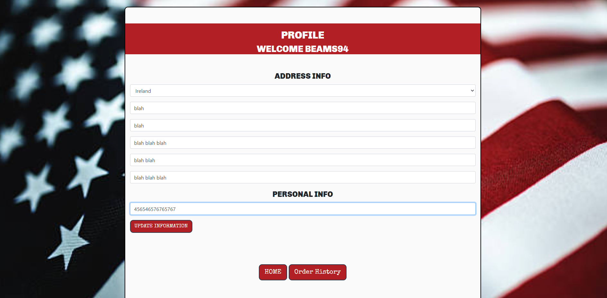

# Scope

The [landing-page](./media/home-page.png) provides the user with an oversite of the page as well as navigation tools such as a search bar, account management, link to view cart with the updated grand total number. 
It also provides the user with the ability to scroll through the various league teams to help the user narrow down his search. 

The [team-page](./media/team-page.png) provides users with a view of all merchandise related to the team which they have navigated to. From here they can select a merchandise whos details they want
to view, filter based on price, if it's signed or game-used merchandise. 

The [merchandise-details-page](./media/merch-page1.png) lets users get a more detailed look at the merchandise with description, price, etc. They can also select a quantity and add it to the cart. 

The [cart-page](./media/cart-page.png) is where users can view what they've added to the cart already. It also allows users to update quantity or remove items from the cart. The link to check out is 
also here for users which means they have to view the cart before proceeding to pay for it which is important. 

The [payment-page](./media/checkout.png) is where users fill out a form to finalize the purchase of their cart. billing info and personal info can be saved here to a profile if the user
is logged in or if they are not will ask them if they would like to register or log in.

The [order-confimred-age](./media/order-page.png) is just a page for the user to confirm his order went through, display the order details and confirm the email that the details had been sent too. 
There is also a link provided to return to shopping. 

The [register/login/logout](./media/signup-page.png) page does exactly as you'd expect, all layouts are similar but only the registration page is linked. 

The [profile-page](./media/profile-page.png) page is set up to let the user enter default info for future checkouts. It also provides a link to order-history.

The [order-history-page](./media/order-history.png) here a user can view all of their previous orders including date, items order number, and address for delivery.

# Structure 

The website is layout with a navigation bar which is fixed with a link to return home on every page, a search bar, account help, and a link to cart with updated total cost numbers. 
There is clear direction on the homepage on what the web site's function is. The Website functionality is based around allowing users to purchase goods from the store so everything is tailored to lead towards adding items to carts and buying them. All merchandise, filtering, and navigation requirements as well as order info is stored in the Django database as explained below. 

## The Database Structure
The main database models are Merchandise, Team, League, UserProfile (user), and orders. On the admin screen staff and superusers can add, delete, update and read merchandise, teams,
leagues, and order info. For User info, they can only see who has registered an account and their email but profile info can only be edited on my profile page or if payment info is saved to profile.
The merchandise model has connected to the team models through a foreign key as well as the league. The team model has a foreign key connection to the league model as well. This allows 
merchandise to connect to the respective pages of the teams and leagues which helps to search for them. 
When an order is made if the user is logged the order will have a foreign key attaching to the user profile allowing the user to view the details in order history at any time if they are not logged in this
the field will be left null.

### Merchandise

The Merchandise model as said before is connected to league and team. It also has boolean fields for game-used or if the merchandise is signed which is used for filters. The stock field prevents
users from entering larger quantities then what is in stock. Name and description fields can be used for search and we've made a custom SKU for all merchandise. 

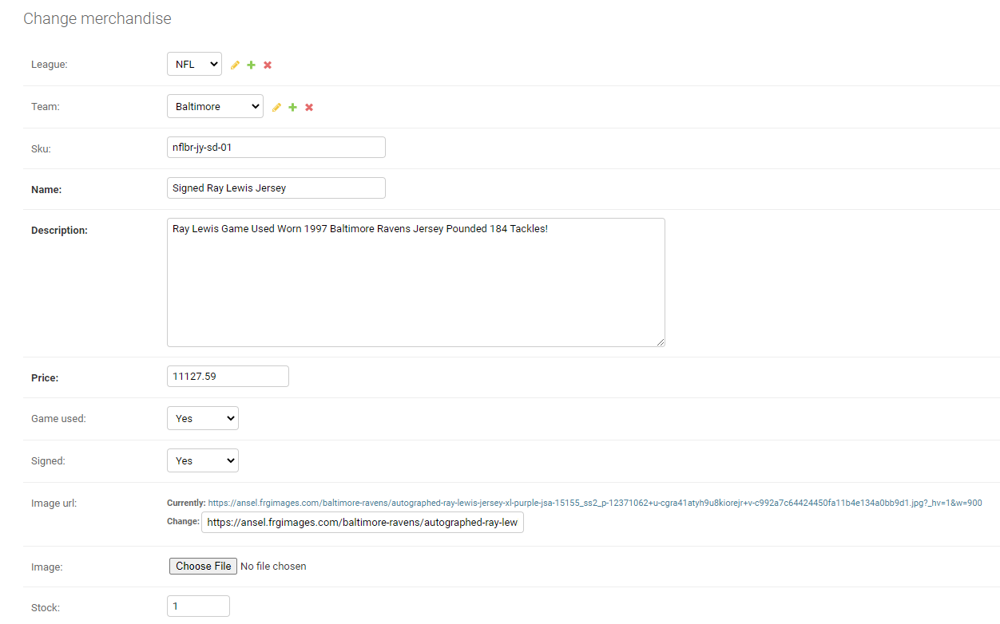

### Teams and Leagues

Both the league and the team are used as ways of filtering merchandise as well as keys for the merchandise to be allocated correctly. In the league model, there is a font-awesome class as well 
for display purposes, in the team model nickname and images are fields, the nickname's to differentiate the different teams from the same city and the images are used as background
for the team pages. 

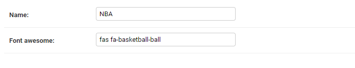
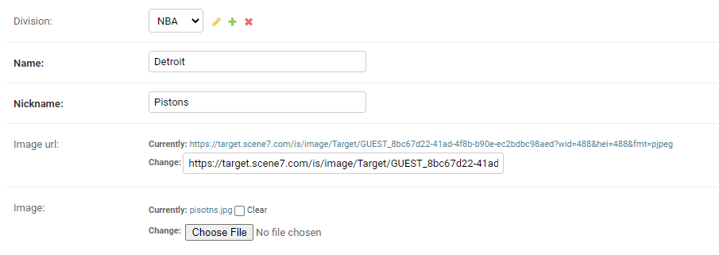

### User Profiles and Orders 

The user profile model is used to store the default address info and attach it to a certain user. The info can be entered in conjunction with UserForm and through saved-info on the checkout page. 
Orders are marked with uniquely generated order-numbers, date of order, delivery cost, order cost, and total cost. Orders are linked by a user foreign key which is used to add order to history, if
the user is not logged in this will just be an empty field. orignal_cart and the character field stripe_pid guarantee that even if users make identical orders being logged in the database as individual orders. 
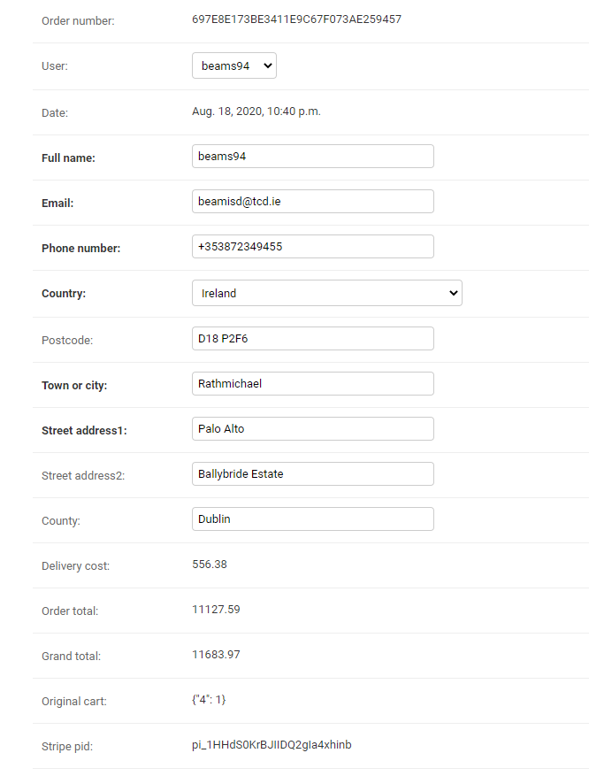

# Skeleton 

[landing page](./media/wireframe-index.png) - stayed true to original designs on the landing page except we added a container div with a background image. 

[team page](./media/wireframe-team.png) - changed the payout of the team page slightly moved everything into a container div with a background image of the team and added a welcome banner.

[merch page](./media/wireframe-individual-merch.png) - changed up the individual page a good bit this was because once again a container div was added to help contrast because of the hero-image. Descriptions were not
as necessary for these sorts of items so image became a larger part as well. 

# Surface
The hero image and index-container image are supposed to add to the cheesy American feel to the website. The font Special Elite is also supposed to add to this casual and fun feel.
Every team page has a background image of the team's logo as well as a welcome banner to leave the user in no doubt what team merchandise they are browsing. 

# Features

# 1)
Users can browse through merchandise with the ability to add to, update quantity, remove and view merchandise in the cart. Payments can be made
for cart items with all fields that are required are submitted. 

# 2)
Profiles can be made to which customers can pre-add billing info and look at their order-history.

# 3) 
If the profile logged in is a superuser or staff member they can access the admin page through the management option in accounts nav, here they can 
 add, delete, update merchandise, team, league, and check order info.

## Future Features

#### 1) Stock management

We would have liked to complete the features regarding stocks for the merchandise, such as removing purchased quantity form stock and fixing bugs that allow more than the amount of stock to be added 
to cart but time was an issue here so we removed attempts to do this and hopefully will be added at a future date. 

#### 2) Favourite teams for user profile
Originally the userProfile model had a favorite team as a field but it was removed as once again time constraints didn't allow us to fully use the function. We were
hoping to add background images on all profile pages of favorite team image as well as maybe emails to users if an item was added to their favorite team. 

# Technologies 

1) HTML

2) CSS

3) Django

4) Python

5) Javascript
 
6) Bootstrap

7) Stripe

8) AWS

# Testing

Display, images, and links worked fine on google chrome, firefox, and Microsoft edge. 
Used W3 validator for CSS and HTML and the pep8.com to check the python was displayed up to 
standard. On each browser check, we tested on mobile view(iPhone 6/78), iPad view on 
both rotations, and in general browser view. Only problem is sometimes the images dont load on mobile chrome and firefox,
although a refresh solves this i didnt know why that was the case On Checkout views.py, webhookhandler.py, 
webhooks.py, and in setting.py all have one or two lines that are two long according to pep8 but 
we determined that for readability and functionality that those respective lines would be left as is. 

All forms and links were tested manually and worked. Forms from the profile linked up nicely with checkout, payments went through
with the correct response from webhooks and the order, info was successfully stored. 
Emails were sent for verification and on payment completion. Multiple practice accounts where setup successfully 
well with logout, login, password change, and if authorised link to admin all functioning. 

Had a good bit of trouble validating the profile page as it required a login so th valedator turned up a 500 message. Then when 
manually entered was giving problems realted to the search bar on the page but managed to fix it. 

# Deployment

The project was completed on gitpod and deployed on Heroku. To connect our gitpod to Heroku we
first created an app which we called ‘united-states-of-sports’. After this, we associate the Heroku
app with our master repository so that we can push our work on to Heroku. For this to work we had
to first create a Procfile in gitpod which is like an instructor to Heroku on which files it needs
to run the project. 

All static files were stored on AWS in which the s3 bucket was connected through AWS-access-key and
AWS-secret-key on Heroku. 

# Credits and Acknowledgements

Stripe documentation was used to help set up the stripe payments particularly the documentation on webhooks and
accepting payments linked [here](https://stripe.com/docs/webhooks/build) [here](https://stripe.com/docs/payments/checkout/accept-a-payment) respectively.

Django basics on Geeks for geeks was used to help with the understanding of Django linked [here](https://www.geeksforgeeks.org/django-basics/?ref=leftbar-rightbar)

Bootstrap documentation was used for navbars, scroll functions, template layout and for margins and paddings linked [here](https://getbootstrap.com/docs/4.0/getting-started/introduction/)

For jinja related issues and for many other small coding problems stack overflow proved to be a valuable asset. linked [here](https://stackoverflow.com/questions/26184070/return-a-conditional-if-statement-based-on-list-length) is
an example of how we fixed an if statement problem.

Testing emails for confirmation, validation and order summary were checked with help of temp emails linked [here](https://temp-mail.org/en/)

AWS was used to store static files and media files linked [here](https://aws.amazon.com/free/?trk=ps_a131L0000085EJvQAM&trkCampaign=acq_paid_search_brand&sc_channel=ps&sc_campaign=acquisition_US&sc_publisher=google&sc_category=core-main&sc_country=US&sc_geo=NAMER&sc_outcome=acq&sc_detail=aws&sc_content=Brand_Core_aws_e&sc_segment=432339156150&sc_medium=ACQ-P|PS-GO|Brand|Desktop|SU|Core-Main|Core|US|EN|Text&s_kwcid=AL!4422!3!432339156150!e!!g!!aws&ef_id=CjwKCAjwm_P5BRAhEiwAwRzSO-e7eHWcphM6XbucO1BYMteUtdIM89kcsFTxevZIPj3-qhH031zLMRoC5t0QAvD_BwE:G:s&s_kwcid=AL!4422!3!432339156150!e!!g!!aws&all-free-tier.sort-by=item.additionalFields.SortRank&all-free-tier.sort-order=asc)

All Merchandise info was pulled from sportsmemorabilia.com including images linked [here](https://www.sportsmemorabilia.com/)

# Media

All teams images came from google searches

hero image and home page container image where pulled form google searches